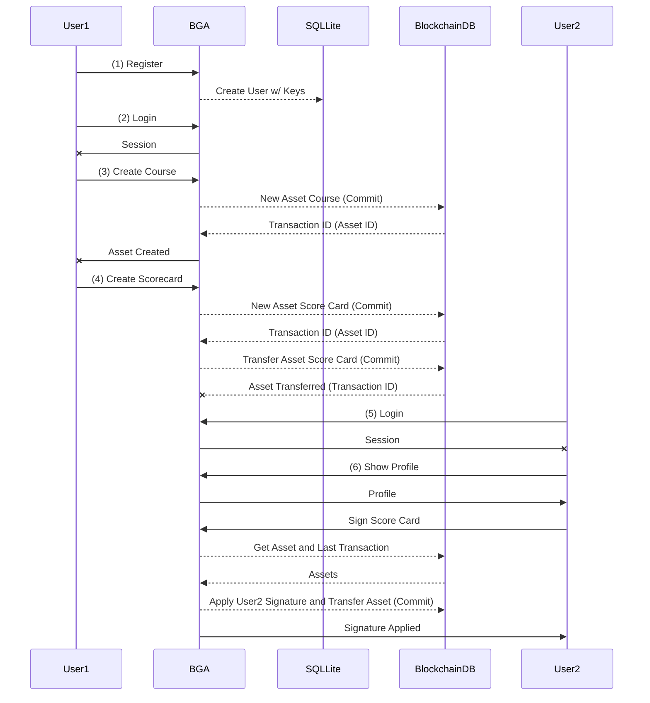

# Blockchain Golfers Association
Authored By: Chris Gill
Last Commit Date: 12/14

**A Demonstration of this application is hosted [here](https://arcane-cove-47033.herokuapp.com/) for your testing pleasure**

This project is a prototype web application built as a final project for my Harvard Extension School Course: *Introduction to Bitcoin and Blockchain - CSCI E-118 (15767)*

This project is intended to showcase the ability of a simple web application to store meta-data on [BigchainDB](https://www.bigchaindb.com/). The back-end application is written in Python (using the [Pyramid Web Framework](https://trypyramid.com/)) and leverages basic HTML, CSS, and some JavaScript for the front-end.

**NOTE: THIS IS NOT A PRODUCTION WORTHY APPLICATION**
 - It has not been security tested
 - It stores usernames/passwords and privatekeys in an embedded sqllite database
 - It leverages the Test environment hosted by BigchainDB @ https://test.bigchaindb.com

**DO NOT RUN OR LOAD THIS APPLICATION WITH ANY REAL DATA**

# Code Summary
This project is a standard pyramid web application built using cookiecutter with the addition of the bigchaindb-driver software package to allow for communication with the BigchainDB network of choice.

BigchainDB is a blockchain-database hybrid which has recently been deemed the platform for the forthcoming IPDB (Interplanetary Database) to serve as a blockchain based meta-data storage akin to what IPFS does for files. It is not strictly a blockchain, nor a database, but instead combines best of both worlds summarized [here](https://www.bigchaindb.com/features/) by BigchainDB.

The bulk of the BigchainDB interactions in this project can be found in the views in [default.py](https://github.com/KarmaPoliceT2/bga/blob/master/bga/views/default.py). BigchainDB considers "objects" stored on the blockchain to be "Assets" and transactions can then be performed to create and transfer assets. An asset is composed of immutable "data" (json) and changeable "metadata" (json). During transactions "metadata" may be applied to the transaction to serve as "variable" data that will change with the asset over time. Using a basic car example, "mileage" would be metadata as it would be different at each point of transfer and make/model would be "data" as it does not change.

This application is intended to be a prototype for storage of golf scores which can be signed by the player and an "attesting" party as is standard for submission to handicapping services such as the USGA. The basic workflow for operating the site is as follows:

## Walkthrough
 1. User Registers with the site
 2. User adds any golf courses which are not already on the blockchain
 3. User creates a scorecard, during which time they select another user to "attest" (sign) their scorecard
 4. The scorecard is created on the blockchain and transferred to the attest user for signature
 5. Attest user logins in separately and navigates to their profile where they find scorecards awaiting their signature
 6. Attest user clicks sign and the blockchain asset is transferred back to the player with a verifiable digital signature.
	 Note: Ideally this step would be re-created leveraging a key wallet such as metamask, however that was out of scope for this project, and thus keys are provisioned and stored in the application.

## Diagrams
The following diagram out the process of creating, signing, attesting, and storing data in the BGA Solution:
### Data Model Diagram
### Sequence Diagram

## Last Mile Concerns
Blockchain is subject to many "last mile" complexities require significant efforts and engineering to close such gaps. Some of the concerns highlighted by this solution are:

 - Lack of consistent wallet integrations to function across all types of devices, which for golfers means watches, phones, tablets, and a variety of other hardware due to their mobile nature.
 - A requirement of trust in lack of collusion between the signer and attester of a scorecard. If these two parties were to collude they could conceivably enter whatever score they desired. Ultimately this is viewed as "only cheating oneself" in the sport of golf.
 - Immature technology, while BigchainDB shows great promise for MASSIVE scale databasing, it is still in its infancy and shows signs of that through it's fairly low-level library interactions for major languages.

## License Coverage
My original works herein are released under the MIT License, other licenses to be considered as used in this project are as follows:
| Name                    | Version    | License                                         |
|-------------------------|------------|-------------------------------------------------|
| Click                   | 7.0        | BSD                                             |
| Jinja2                  | 2.10       | BSD                                             |
| Mako                    | 1.0.7      | MIT                                             |
| MarkupSafe              | 1.1.0      | BSD                                             |
| PasteDeploy             | 2.0.1      | MIT                                             |
| Pygments                | 2.3.0      | BSD License                                     |
| SQLAlchemy              | 1.2.15     | MIT License                                     |
| WTForms                 | 2.2.1      | BSD                                             |
| WebHelpers2             | 2.0        | UNKNOWN                                         |
| WebOb                   | 1.8.4      | MIT                                             |
| WebTest                 | 2.0.32     | MIT                                             |
| alembic                 | 1.0.5      | MIT                                             |
| arrow                   | 0.12.1     | Apache 2.0                                      |
| asn1crypto              | 0.24.0     | MIT                                             |
| atomicwrites            | 1.2.1      | MIT                                             |
| attrs                   | 18.2.0     | MIT                                             |
| autopep8                | 1.4.3      | Expat License                                   |
| base58                  | 1.0.2      | MIT                                             |
| bcrypt                  | 3.1.5      | Apache License, Version 2.0                     |
| beautifulsoup4          | 4.6.3      | MIT                                             |
| bga                     | 0.0        | UNKNOWN                                         |
| bigchaindb-driver       | 0.6.2      | Apache Software License 2.0                     |
| binaryornot             | 0.4.4      | BSD                                             |
| certifi                 | 2018.11.29 | MPL-2.0                                         |
| cffi                    | 1.11.5     | MIT                                             |
| chardet                 | 3.0.4      | LGPL                                            |
| colorama                | 0.4.1      | BSD                                             |
| cookiecutter            | 1.6.0      | BSD                                             |
| coverage                | 4.5.2      | Apache 2.0                                      |
| cryptoconditions        | 0.8.0      | MIT                                             |
| cryptography            | 2.3.1      | BSD or Apache License, Version 2.0              |
| future                  | 0.17.1     | MIT                                             |
| hupper                  | 1.4.2      | MIT                                             |
| idna                    | 2.8        | BSD-like                                        |
| jinja2-time             | 0.2.0      | MIT                                             |
| more-itertools          | 4.3.0      | MIT                                             |
| passlib                 | 1.7.1      | BSD                                             |
| plaster                 | 1.0        | UNKNOWN                                         |
| plaster-pastedeploy     | 0.6        | UNKNOWN                                         |
| pluggy                  | 0.8.0      | MIT license                                     |
| poyo                    | 0.4.2      | MIT                                             |
| py                      | 1.7.0      | MIT license                                     |
| pyasn1                  | 0.4.4      | BSD                                             |
| pycodestyle             | 2.4.0      | Expat license                                   |
| pycparser               | 2.19       | BSD                                             |
| pynacl                  | 1.3.0      | Apache License 2.0                              |
| pyramid                 | 1.10.1     | BSD-derived (http://www.repoze.org/LICENSE.txt) |
| pyramid-debugtoolbar    | 4.5        | BSD                                             |
| pyramid-jinja2          | 2.7        | BSD-derived (http://www.repoze.org/LICENSE.txt) |
| pyramid-mako            | 1.0.2      | BSD-derived (http://www.repoze.org/LICENSE.txt) |
| pyramid-retry           | 1.0        | UNKNOWN                                         |
| pyramid-tm              | 2.2.1      | BSD-derived (http://www.repoze.org/LICENSE.txt) |
| pysha3                  | 1.0.2      | PSFL (Keccak: CC0 1.0 Universal)                |
| pytest                  | 4.0.1      | MIT license                                     |
| pytest-cov              | 2.6.0      | MIT                                             |
| python-dateutil         | 2.7.5      | Dual License                                    |
| python-editor           | 1.0.3      | Apache                                          |
| python-rapidjson        | 0.6.3      | MIT License                                     |
| python-rapidjson-schema | 0.1.1      | Apache2                                         |
| repoze.lru              | 0.7        | BSD-derived (http://www.repoze.org/LICENSE.txt) |
| requests                | 2.21.0     | Apache 2.0                                      |
| six                     | 1.12.0     | MIT                                             |
| transaction             | 2.4.0      | ZPL 2.1                                         |
| translationstring       | 1.3        | BSD-like (http://repoze.org/license.html)       |
| urllib3                 | 1.24.1     | MIT                                             |
| venusian                | 1.1.0      | BSD-derived (http://www.repoze.org/LICENSE.txt) |
| waitress                | 1.1.0      | ZPL 2.1                                         |
| whichcraft              | 0.5.2      | BSD                                             |
| zope.deprecation        | 4.4.0      | ZPL 2.1                                         |
| zope.interface          | 4.6.0      | ZPL 2.1                                         |
| zope.sqlalchemy         | 1.0        | ZPL 2.1                                         |
